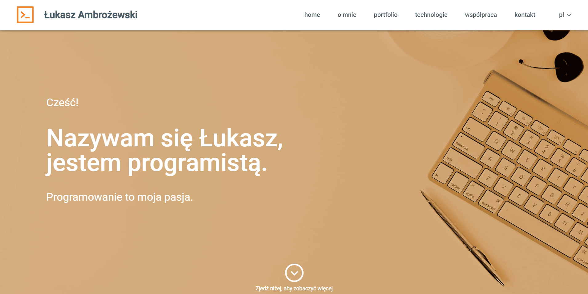

# Hi there 👋

I have always been interested in technology and creating new products. In May 2021, I started learning intensive programming. Programming gives me great satisfaction, and the specificity of a programmer's work is something that fits perfectly into my predispositions. For example, I am a person who does not like to stand still. It is amazing to me what huge development opportunities the IT industry offers. More recently, in October 2022, I started an internship at the NeuroN Foundation as a <strong>Junior React Developer</strong>. Together with a team of IT specialists, we are creating a platform for bringing together the design community. Thanks to my experience at the foundation, I can combine the possibility of helping others with my passion for programming. In my team, we work with the SCRUM methodology using professional tools such as Jira, Figma, Slack, and AWS. 

 

 

## My technology stack

 &nbsp;&nbsp;&nbsp;&nbsp;
 &nbsp;&nbsp;&nbsp; 
  &nbsp;&nbsp;&nbsp; 
 &nbsp; &nbsp;&nbsp;&nbsp;
 &nbsp; &nbsp;&nbsp;&nbsp; 
 &nbsp; &nbsp;&nbsp;&nbsp;
 &nbsp;
 &nbsp; &nbsp;&nbsp;
 &nbsp; &nbsp;&nbsp;
 &nbsp; &nbsp;
 &nbsp;&nbsp;&nbsp;&nbsp; 
 &nbsp; &nbsp;&nbsp;&nbsp;
 &nbsp; &nbsp;&nbsp;&nbsp;

 

###  👨‍💼 I'm looking for a job.

### 🌱 I'm currently improve me skills in NestJS and React.js.

 

## Projects 🚩

### Personal Website

This is a website where I introduce myself. It contains all the necessary information about the technologies I work in. The site also includes contact information and a portfolio showing the projects I have worked on.
The website is fully responsive. I made the project myself using figma and gimp. 

<a href="https://lukaszambrozewski.pl/" target="_blank" rel="noreferrer">
 

</a>&nbsp; &nbsp;&nbsp;&nbsp;

Frontend: https://github.com/LukaszAmbrozewski/PersonalWebsite

Live: https://www.lukaszambrozewski.pl/

#### Technologies used

 &nbsp;&nbsp;&nbsp;&nbsp;
 &nbsp;&nbsp;&nbsp;
 &nbsp; &nbsp;&nbsp;&nbsp;
 &nbsp; &nbsp;&nbsp;&nbsp;
 &nbsp; &nbsp;&nbsp;&nbsp;
 &nbsp; &nbsp;
 &nbsp;&nbsp;&nbsp;&nbsp; 

 
 

### InvoiceApp
The application is my new full-stack project. I designed and made the views, backend and frontend myself. The application was designed with a mobile first approach. The frontend part of application is under development. The application simplify the process of creating invoices and managing the customer base.

Frontend: https://github.com/LukaszAmbrozewski/InvoiceApp-frontend

Backend: https://github.com/LukaszAmbrozewski/InvoiceApp-backend

Demo: https://youtu.be/UZD3GzYPuu8

#### Technologies used

 &nbsp;&nbsp;&nbsp;&nbsp;
 &nbsp;&nbsp;&nbsp; 
  &nbsp;&nbsp;&nbsp; 
 &nbsp; &nbsp;&nbsp;&nbsp;
 &nbsp; &nbsp;&nbsp;&nbsp;
 &nbsp;
 &nbsp; &nbsp;&nbsp;
 &nbsp; &nbsp;
 &nbsp;&nbsp;&nbsp;&nbsp; 

 
 

### FlashcardApp
The application is designed to help in learning process. It allows you to create your own flashcards and use ready-made collections of flashcards. Everyone register user can adding new card and has access to their own flashcards. Each user can use publicly available flashcards without logging in. The learning section randomly selects a flashcard and allows to show their reverse.

Frontend: https://github.com/LukaszAmbrozewski/flashcard-front

Backend: https://github.com/LukaszAmbrozewski/flashcard-back

#### Technologies used

&nbsp;&nbsp;&nbsp;&nbsp; 
 &nbsp;&nbsp;&nbsp; 
&nbsp; &nbsp;&nbsp;&nbsp;
&nbsp; &nbsp;&nbsp;&nbsp;&nbsp;&nbsp;&nbsp;&nbsp; 
 &nbsp;&nbsp;
&nbsp;&nbsp;
&nbsp;&nbsp;
&nbsp; &nbsp;&nbsp;&nbsp; 

 
 

## 📫 How to reach me: 

&nbsp;&nbsp;&nbsp;&nbsp;&nbsp;&nbsp;&nbsp;&nbsp;&nbsp;&nbsp;&nbsp;&nbsp;&nbsp;&nbsp;&nbsp;&nbsp;<a href="mailto: lukaszambrozewski@gmail.com" target="blank">&nbsp;&nbsp;&nbsp;&nbsp;lukaszambrozewski@gmail.com</a>

